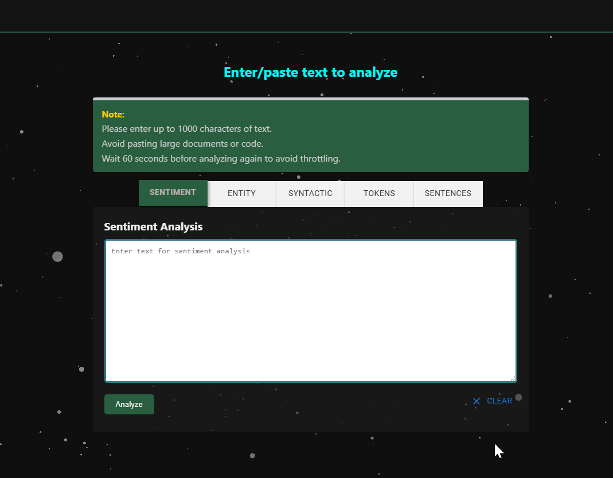
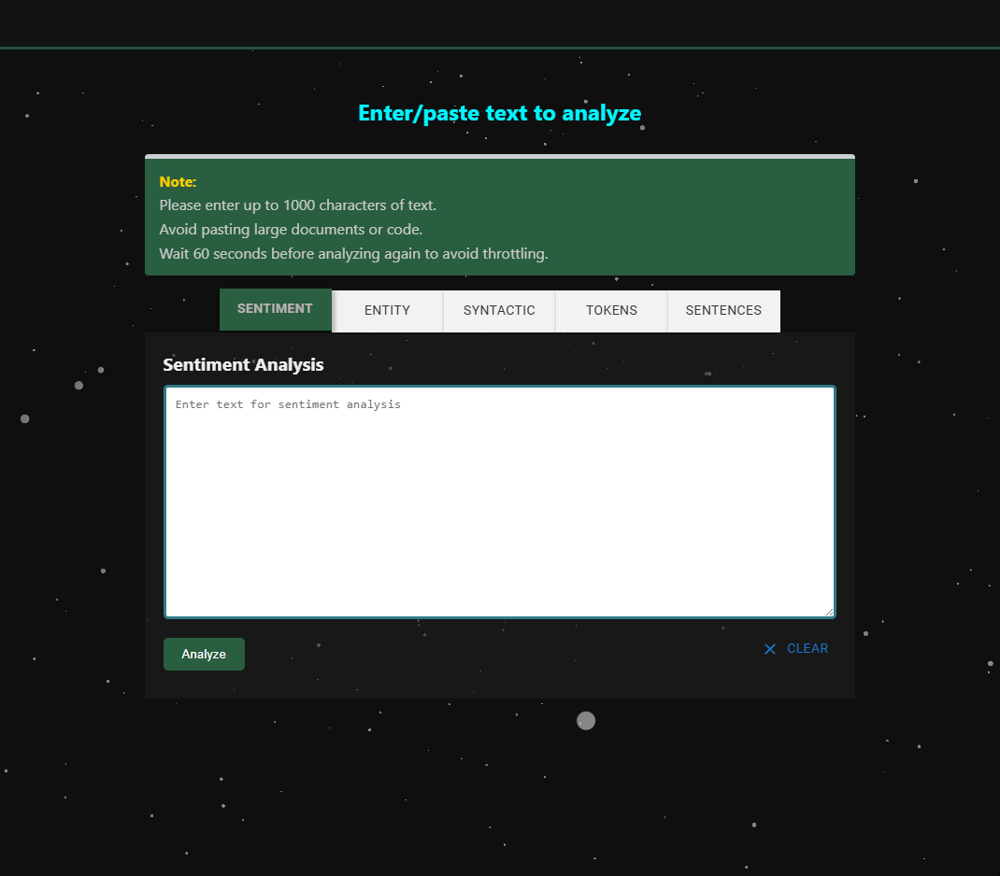

# v1.1.0
## New Additions and Info

### 1. Animated Background

### 2. Decrypted Text Animation - Sentiment

### 2. Decrypted Text Animation - Entity

### Decrypt-style Text Animation

Most section headers and result texts now animate as if they're being decrypted letter by letter.

- Animation triggers when the text enters the screen
- Speed is set at 100ms for a smooth reveal
- Useful for titles, notes, API result summaries and lists
- Adds a bit of visual interest to otherwise static text
- Animations extracted from: https://www.reactbits.dev/
---

### Rate Limiting

To avoid sending too many requests:

- There’s a 60-second delay before analyzing again
- Message will show: "Please wait before analyzing again."
- Helps reduce backend errors and keeps things from crashing

---

### Text Limits and Usage Tips

- Max length is 1000 characters
- Avoid submitting long essays or code
- Analysis tabs work one at a time

---

### Developer Notes

- The decrypt effect is handled with a `<DecryptedText />` component
- Animation direction and behavior can be customized with props
- Particle background responds to cursor movement
- Styling handled with CSS + Material UI

# ContentAnalysisApp (v1.0.0)

A web app that analyzes text using Google Cloud's Natural Language API. It can break down sentiment, detect entities, and analyze syntax. You can either enter your own text or pull from news articles using the Newsdata.io API.

## Features

- Analyze user-entered text or fetched news articles
- Sentiment analysis (positive, negative, neutral)
- Entity recognition (names, places, organizations)
- Syntax analysis (parts of speech and structure)
- News integration from Newsdata.io
- Hosted on Firebase

## Tech Stack

- React with TypeScript
- Firebase Hosting and Functions
- Google Cloud Natural Language API
- Newsdata.io
- GitHub version control

## Constraints

- The Google NLP API is disabled due to budget constraints
- No request rate limiting (would have helped)
- Analysis is limited to English text

## Future Plans (if resumed)

- Replace Google NLP with OpenAI or similar
- Add rate limiting and API usage quotas
- Allow users to log in and view analysis history
- Generate content summaries and detect writing tone

## Run Locally

Clone the repo, then:

### `npm install`
### `npm start`

App will be available at `http://localhost:3000`

## License

- No License

## v0.5.5
- Changed React State hook to maintain text inside textbox when switching tabs.
- News Feed now routed to Resources link on Navbar.

## v0.5.4
- Added exporting to spreadsheet for sentence analysis.
  
## v0.5.3
- Added sentence analysis with aggregated salience score.

## v0.5.2
- Added exporting EntitySentiment Table to Excel.

## v0.5.1
- Added Table for entity sentiment results.

# v0.5.0
- Entity Sentiment Analysis: Analyzing the sentiment by each entity identified.
 

## v0.4.8
- Added explaination for text dependency.

## v0.4.7
- Added legend for part of speech.
  
## v0.4.6
- Added Syntax Visualization to syntactic analysis.

## v0.4.5
- Fixed: Text overlap result sections, added category for each text.

## v0.4.4
- Fixed: x label, set result box height to data length.

## v0.4.3
- Added D3js Visualization for entity analysis results.

## v0.4.2
- Added Pie chart for visualization with D3js library from sentences.
  
## v0.4.1
- Added Sentence-level sentiment analysis.

 

# v0.4.0
## Additional Features:
- Syntactic Analysis: Analyzing the grammatical structure of a sentence to understand its syntax.
 

# v0.3.0

- Entity Analysis: identification of key entities (e.g., names, organizations) within the text.

- Analysis Dashboard Tabs: Switch between Sentiment analysis and Entity analysis functions.

 

# v0.2.0
- News articles fetched to app using API, a few topics for now.

- Google Natural Language API Integration for text analysis.

- Sentiment Analysis: Users can now analyze the sentiment of input text directly through the application.

 

# v0.1.0
- Login & Register Authentication.
- Login & Register Form.
- Mobile responsive.

# Getting Started with Create React App

This project was bootstrapped with [Create React App](https://github.com/facebook/create-react-app).

## Available Scripts

In the project directory, you can run:

### `npm start`

Runs the app in the development mode.\
Open [http://localhost:3000](http://localhost:3000) to view it in the browser.

The page will reload if you make edits.\
You will also see any lint errors in the console.

### `npm test`

Launches the test runner in the interactive watch mode.\
See the section about [running tests](https://facebook.github.io/create-react-app/docs/running-tests) for more information.

### `npm run build`

Builds the app for production to the `build` folder.\
It correctly bundles React in production mode and optimizes the build for the best performance.

The build is minified and the filenames include the hashes.\
Your app is ready to be deployed!

See the section about [deployment](https://facebook.github.io/create-react-app/docs/deployment) for more information.

### `npm run eject`

**Note: this is a one-way operation. Once you `eject`, you can’t go back!**

If you aren’t satisfied with the build tool and configuration choices, you can `eject` at any time. This command will remove the single build dependency from your project.

Instead, it will copy all the configuration files and the transitive dependencies (webpack, Babel, ESLint, etc) right into your project so you have full control over them. All of the commands except `eject` will still work, but they will point to the copied scripts so you can tweak them. At this point you’re on your own.

You don’t have to ever use `eject`. The curated feature set is suitable for small and middle deployments, and you shouldn’t feel obligated to use this feature. However we understand that this tool wouldn’t be useful if you couldn’t customize it when you are ready for it.

## Learn More

You can learn more in the [Create React App documentation](https://facebook.github.io/create-react-app/docs/getting-started).

To learn React, check out the [React documentation](https://reactjs.org/).
